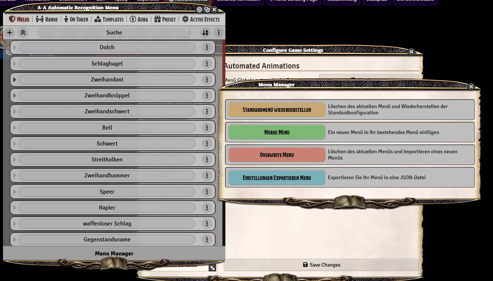

# Automated Animations

Attached to this module you can find a configuration file for automated animations ready to be imported.
This file provides previously configured settings for animations of weapon, spell and monster attacks in conjunction with the module automated animations and JB2A.

## Installation

The automated animations file is also available via the module [dsa5-glueandhammer](https://foundryvtt.com/packages/dsa5-glueandhammer).
You can do one of the following things:

* Install the module dsa5-glueandhammer and import the configuration file for your language from the folder modules/dsa5-glueandhammer/configs/automatedanimations
* Download the automated animations file from this repository and import it afterwards with the automated animations module

## Contribution

You are invited to add your own animations for TDE to this file, just export your settings in TDE and attach them to an issue in this repository and we will do a merge. Your contribution will be made available for all other users.
If you are more experienced you can also immediately make a pull request and merge your additional changes into the existing configuration file.

## Howto

### Import automated animations file

* Open the game settings in your foundry world
* Navigate to the automated animations sections
* Open the automated animations menu
* Press Menu Manager on the bottom
* Select your desired import method

### Export automated animations file

* See import automated animations file except:
* Chose export settings
* Save file 
* Create a ticket in this repository
* Add File
* Add informations on changed or new animations

## Status

You can check all the coverage of the current file right here:
[Animation automation coverage de](animationsummary_de.md) 
[Animation automation coverage en](animationsummary_en.md) 